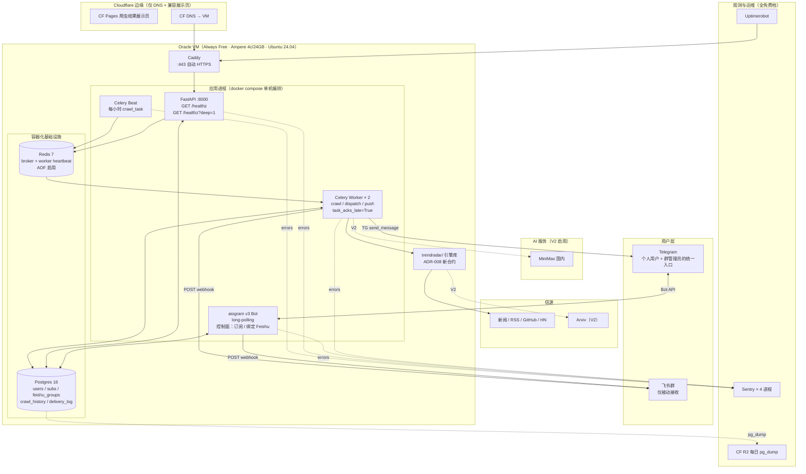

# TrendRadar 平台化 · 架构选型

> **版本**：v0.2 DRAFT
> **作者**：neo + Claude
> **日期**：2026-04-24
> **上游依赖**：[product-spec.md](./product-spec.md) v0.3
> **下游文档**：[technical-design.md](./technical-design.md)
> **变更**：
> - v0.2（架构评审后）：重写 ADR-004（TG 作控制面，砍 Web form）；ADR-007 延期；新增 ADR-008 引擎集成 / ADR-009 Migration / ADR-011 幂等与重试；ADR-001 附 CF Workers 迁移 sidebar；升级 §7 观测性；修 C1/C3/C5；Caddy 替换 nginx；部署拓扑简化。
> - v0.1 初稿。

---

## Review Status

| 章节 | 状态 | 备注 |
|---|---|---|
| §1 整体架构图 | ✅ Aligned (v0.2) | 去 Web form 分支 |
| §2 核心组件职责 | ✅ Aligned (v0.2) | 去 CF Pages Feishu form |
| §3.1 ADR-001 计算平台 | ✅ Aligned (v0.2) | 新增 Workers 迁移 sidebar |
| §3.2 ADR-002 数据层 | ✅ Aligned | |
| §3.3 ADR-003 消息队列 / 调度 | ✅ Aligned (v0.2) | 加 C1 防范配置 |
| §3.4 ADR-004 交付渠道 | ✅ Aligned (v0.2) | TG 作控制面 |
| §3.5 ADR-005 关键词匹配 | ✅ Aligned | |
| §3.6 ADR-006 Bot SDK | ✅ Aligned | |
| §3.7 ADR-007 Web 前端 | 🚫 v0.2 Deferred | V2 若需再启 |
| §3.8 ADR-008 引擎集成（新） | ✅ Aligned (v0.2 New) | C5 修复 |
| §3.9 ADR-009 Migration 策略（新） | ✅ Aligned (v0.2 New) | H5 修复 |
| §3.10 ADR-011 幂等与重试（新） | ✅ Aligned (v0.2 New) | C1 + H4 修复 |
| §4 部署拓扑 | ✅ Aligned (v0.2) | Caddy；去 Web form |
| §5 成本估算 | ✅ Aligned (v0.2) | 无 Turnstile 成本 |
| §6 回退路径 | ✅ Aligned (v0.2) | 加 worker 心跳 / 超时 |
| §7 可观测性策略 | ✅ Aligned (v0.2) | worker heartbeat / 超时 / Sentry × 4 进程 |
| §8 安全边界 | ✅ Aligned (v0.2) | 去 magic-link |

## 验收标准自检

| # | 标准 | 自检 |
|---|---|---|
| A1 | 整体架构图 mermaid，标出所有组件 + 数据流 | ✅ §1 |
| A2 | ADR ≥6 条覆盖计算 / 数据 / 渠道 / 调度 / 匹配 / Bot SDK | ✅ §3 有效 ADR 共 8 条 |
| A3 | 每条 ADR 含背景 / ≥2 备选 / 决策 / 理由 / 代价 / 回退 | ✅ §3 所有 ADR 均有 6 节 |
| A4 | 部署拓扑分 local / prod 两份 | ✅ §4 |
| A5 | 成本估算表 | ✅ §5 |
| A6 | 回退路径可执行 | ✅ §6 runbook 8 项 |
| A7 | 选型理由可追溯到产品约束 | ✅ §3 各 ADR 均引用产品条目 |
| A8 | 可观测性策略 | ✅ §7（升级版） |

---

## §1 整体架构图



**数据流向**

1. **订阅 / 绑定**（唯一入口 = TG Bot）
   - 个人订阅：TG user → Bot → PG（User + Subscription）
   - 飞书群绑定：TG user（群管理员）→ Bot（`/add_feishu_group <url> <keywords>`）→ PG（FeishuGroup + Subscription 双写）
2. **定时爬取**：Beat → Redis → Worker → trendradar 库 → 信源 → PG（crawl_history + ON CONFLICT DO UPDATE）
3. **扇出推送**：Worker 读 history + subscriptions → contains 匹配 → 每个 `(subscription, item, delivery_target)` 先 `INSERT delivery_log ... ON CONFLICT DO NOTHING RETURNING id` → 有 id 才真推送（ADR-011）
4. **观测**：4 进程都接 Sentry；worker 每 60s 往 Redis 写 heartbeat；`/healthz?deep=1` 检查 PG+Redis+heartbeat 新鲜度

---

## §2 核心组件职责

| 组件 | 运行方式 | 职责 | 依赖 |
|---|---|---|---|
| TG Bot（aiogram v3） | container，polling | **控制面**：订阅 CRUD / 绑定 Feishu 群 | `aiogram>=3.13` |
| FastAPI | container，uvicorn | 健康检查 + 内部接口（V1 极少） | `fastapi` |
| Celery Beat | container，单实例 | 触发 `crawl_task` 每小时一次 | `celery[redis]>=5.4` |
| Celery Worker | container × 2 | crawl → dispatch → push | 同上 |
| Postgres | container | 持久化；WAL；R2 每日备份 | `postgres:16-alpine` |
| Redis | container | broker + 短缓存 + heartbeat；AOF 启用 | `redis:7-alpine` |
| trendradar 引擎 | 库，Worker 内调用 | 爬虫执行器（ADR-008 合约） | 已有 + 需重构 |
| Caddy | 宿主机 systemd | :443 自动 HTTPS → API :8000 | Caddy v2 |
| CF DNS | 边缘 | 域名解析到 VM 公网 IP | CF 免费 |
| CF Pages 展示页 | 边缘 | 当前爬虫结果页（兼容） | CF 免费 |

**对比 v0.1 删除**：~~CF Pages Feishu 登记页~~、~~Turnstile~~、~~Web form CORS~~、~~FastAPI /api/subscribe /api/edit/:token~~

---

## §3 架构决策记录（ADR）

### §3.1 ADR-001 计算平台

**背景**：需常驻进程（TG bot polling、Celery beat/worker）。V1 5-10 人 / V2 50-200 人。

**备选**

| 方案 | 优 | 劣 |
|---|---|---|
| **Oracle VM Always Free（Ampere 4c/24G）**（选） | 永久免费；资源宽松；SSH 可控 | 境外；ARM 机型偶尔缺货 |
| 纯 GitHub Actions | 零运维 | **无常驻**；SQLite 历史现状就是丢的 |
| 纯 CF Workers（sidebar） | 边缘；免费额度大 | TS-first；需重写 Python 引擎 |
| 云主机（腾讯云/阿里云轻量） | 国内网络好 | 50 元/月起 |

**决策**：Oracle VM Ampere A1.Flex 4 OCPU / 24GB。

**理由**：常驻服务模型必须；Ampere 是唯一"永久免费 + 资源充足 + Linux 常驻"；爬国内源可走代理。

**代价**：注册有风控；ARM 偶尔缺货；境外延迟 80-120ms（CF 前置缓解）。

**回退**：账号封 / 机器开不出 → Hetzner CX22（€4/月）或家里闲机 + CF Tunnel。

#### Sidebar: ADR-001-alt — CF Workers 迁移路径（V2 候选）

**迁移后**：TG Bot 切 webhook → CF Workers；Feishu push → Workers fetch；定时 crawl → Workers Cron Triggers；扇出 → CF Queues；DB → CF D1 或 Neon/Supabase 免费档；爬取引擎 Python → TS 重写，或保留一个极小 VM 仅跑爬取。

**触发信号**：Oracle 反复出问题 / V2 用户 < 100 时边缘更省 / 团队愿付重写成本（~1 周）。

**不立即迁移**：V1 skeleton 已在 VM；trendradar 是 Python，完整迁移成本高；Workers Python Beta 不稳。

---

### §3.2 ADR-002 数据层

**背景**：多用户、跨会话、历史去重、订阅查询、delivery 审计。

**备选**
- **Postgres 16**（选）：成熟；JSONB + ARRAY；pgvector 可加
- SQLite：多进程写锁
- MongoDB：事务弱

**决策**：Postgres 16，容器部署。

**理由**：多进程并发写需事务 DB；`ARRAY(String)` 天然存 keywords；pgvector 为 V2 语义匹配留口子；`pg_dump` + CF R2 免费备份。

**代价**：自管备份和升级；Alembic 必须（见 ADR-009）。

**回退**：见 §6 runbook。

---

### §3.3 ADR-003 消息队列 / 调度

**背景**：定时爬取 + `/now` 实时触发 + 爬完扇出 N 个推送。

**备选**

| 方案 | 优 | 劣 |
|---|---|---|
| **Celery 5 + Redis 7**（选） | 成熟；beat 调度；重试全 | 依赖 Redis 常驻 |
| APScheduler + RQ | 轻量 | 单实例可靠性低 |
| Temporal | 强大 | 过度 |
| crontab + Python | 最简 | 无重试 / 观测 |

**决策**：Celery 5 + Redis 7，**对 V1 规模采用谨慎配置**：

```python
# app/worker/celery_app.py 必须包含
celery_app.conf.update(
    task_acks_late=True,              # 必须完成才 ack，崩溃会重入队
    task_reject_on_worker_lost=True,  # worker 崩了任务重排
    task_time_limit=300,              # 5 分钟硬超时
    task_soft_time_limit=240,         # 4 分钟软超时
    worker_prefetch_multiplier=1,     # 一次取一个
    broker_connection_retry_on_startup=True,
)
```

```yaml
# docker-compose.yml redis service 必须
redis:
  command: >
    redis-server --appendonly yes --appendfsync everysec
```

**代价**：Celery 对 V1（5-10 人）是杀鸡用牛刀，但 skeleton 已用上，不换。V1 `--concurrency=1`；升级触发规则见 ADR-011 末尾。

**回退**：Redis 挂 → 容器 restart；丢 in-flight 任务，但 `delivery_log` ON CONFLICT 保证补跑不重复。Celery 卡死 → `/healthz?deep=1` 检测 heartbeat 过期 → 告警。

---

### §3.4 ADR-004 交付渠道：TG 作控制面，Feishu 仅接收（v0.2 重写）

**背景**：产品 v0.3 §2.3 明确 V1 覆盖 TG 和 Feishu 两类接收渠道，但**控制面统一到 TG**以消灭 Web 前端整条链路。

**备选**

| 方案 | 控制面 | 接收面 | 前端代码 | V1 工作量 |
|---|---|---|---|---|
| 单 TG | TG Bot | TG | 无 | 最小 |
| **TG 控制面 + 双接收**（选） | TG Bot | TG + Feishu | **无** | +0.5 天 |
| 双控制面（TG + Web form） | TG + Web | TG + Feishu | CF Pages + CORS + Turnstile + magic link | +2 天 |
| Feishu Bot 应用 | Feishu 官方 | Feishu | 无 | 需企业认证 |

**决策**：TG Bot 是**全局控制面**，Feishu 群是 TG user 名下挂的"二级投递目标"。

**关键行为**
```
TG 用户 Alice：
  /start
  /subscribe 大模型, agent                      ← 个人订阅
  /add_feishu_group <webhook_url> 大模型         ← Alice 名下挂 FeishuGroup + Subscription
  /my_feishu_groups                             ← 列出
  /edit_feishu_group 42 新关键词
  /remove_feishu_group 42
```

**数据模型影响**（→ technical-design.md）
- `User`（owner = TG user）
- `FeishuGroup`（webhook_url, name, owner_user_id）
- `Subscription`（user_id, keywords[], delivery_targets[] = ["telegram"] | ["feishu:42"] | ["telegram","feishu:42"]）

**理由**
- V1 试用者都在技术圈，TG 门槛不是问题
- 干掉 4 个 moving parts（CF Pages 前端、CORS、Turnstile、magic link）
- 顺带消除评审 C2/C3/C4 三条 critical
- Webhook URL 只经 HTTPS 传到 Bot，不在 Feishu 群聊记录里留明文

**代价**：Feishu 群管理员必须有 TG；非技术 Feishu 管理员（V2 外部用户）需要 Web form（V2 补）。

**回退**：收到"飞书群朋友不用 TG"反馈 → V2 按 v0.1 原方案补最简 Web form。

---

### §3.5 ADR-005 关键词匹配：contains

**背景**：把 item 分派给有对应兴趣的用户。

**备选**

| 方案 | 准确率 | 成本 | 延迟 |
|---|---|---|---|
| **substring contains（大小写不敏感）**（选 V1） | 70-80% | 0 | 毫秒 |
| jieba 分词 + 集合交集 | 80-85% | 低 | 10ms |
| Embedding + 向量相似 | 85-90% | 高（LLM 每 item） | 100-500ms |

**决策**：V1 contains，V2 评估。

**理由**：产品 §8 误推率允许 ≤40%，contains 达标；零成本 / 零新故障面。

**代价**：`agent` 会误匹 `user agent`；V1 接受；V2 加排除词。

**回退**：反馈超标 → 加 `/subscribe agent -"user agent"` 语法支持排除。

---

### §3.6 ADR-006 Bot SDK：aiogram v3

选 aiogram v3；与 FastAPI 同 asyncio 栈共享 event loop；API 清爽。备选 python-telegram-bot v20+，任何时候可一天切换。

---

### §3.7 ADR-007 Web 前端 [v0.2 延期]

v0.1 原方案：CF Pages 静态页 + FastAPI 后端承载 Feishu 订阅管理。

**v0.2 决策：V1 不做 Web 前端**（ADR-004 已让 TG 做全局控制面）。

**V2 重启条件**：收到非技术用户"要 Web 表单"的明确反馈 / 用户 > 50 且 TG 门槛成为增长瓶颈。

**原方案备忘（V2 参考）**：CF Pages 静态 HTML + fetch → FastAPI；必须服务端校验 Turnstile；magic link 每次编辑后轮换。

---

### §3.8 ADR-008 trendradar 引擎集成合约 🆕

**背景**：现有 `trendradar/` 是 CLI 批处理工具（读 yaml → 爬取 → 直写 HTML + SQLite + 通知）。平台化后需作为**库**被 Worker 调用，不再直写输出。

**备选**

| 方案 | 优 | 劣 |
|---|---|---|
| **Library import**（选） | 性能好；异常可捕获；共享进程 | 需要改 trendradar 拆爬取与输出 |
| Subprocess + JSON | 无侵入 | 慢；难传配置；错误处理差 |

**决策**：重构 trendradar 暴露结构化 Python API。

**新 API 合约**
```python
# trendradar/api.py (NEW)
from dataclasses import dataclass
from datetime import datetime
from typing import Iterable

@dataclass(frozen=True)
class CrawledItem:
    fingerprint: str            # sha256(source + '|' + canonical_url)[:16]
    source: str
    category: str | None
    title: str
    url: str
    summary: str | None
    published_at: datetime | None
    raw: dict

def fetch_all(config_path: str | None = None,
              sources: list[str] | None = None) -> Iterable[CrawledItem]:
    """爬取全部或指定信源，返回结构化 item 迭代器。
    此函数不写 HTML，不写 SQLite，不发通知——输出由 app 层处理。
    """
```

**必做重构**
1. 拆 `trendradar/` 为「核心爬取」+「报告输出」两层
2. 爬取核心只返回结构化数据
3. 保留 `python -m trendradar` CLI（兼容旧单机用法），内部调用同一 `fetch_all`
4. `config.yaml` 的信源定义保留，但允许 app 层覆写（代理 / UA / 超时）

**代价**：约 1-1.5 天重构；必须在 V1 Task #5 前完成。

**回退**：重构超预算 → V1 用 subprocess fallback（`python -m trendradar --json`），V1 末期回到 library。

---

### §3.9 ADR-009 Migration 策略 🆕

**背景**：Schema 会演化；多进程部署意味着新旧代码可能短暂并存。

**备选**
- **Alembic + 手工 review autogenerate**（选）
- Alembic autogenerate only：快但漏约束
- 每次重建 DB：V1 可；V2 数据要保，不行

**决策**：Alembic；每次生成 migration 后手工 review。

**流程**
1. 改 SQLAlchemy 模型
2. `uv run alembic revision --autogenerate -m "xxx"`
3. **人工 review** migration（检查 default / 索引 / 约束）
4. `uv run alembic upgrade head`（本地）
5. Commit 到 git
6. 部署：`docker compose run --rm app_api uv run alembic upgrade head` 在 app 启动前跑

**零停机约束（V2 目标）**
- 加字段：必须 nullable 或 server_default → 部署代码 → 可选二次 migration 加 NOT NULL
- 删字段：先停用代码引用 → 部署 → 再删 DB 字段
- 改字段类型：新增字段 + 迁移数据 + 废弃旧字段（禁止原地改）

**回退**：`alembic downgrade -1` + 回滚镜像版本；PG DDL 默认事务化，失败自动回滚。

**月度演练**：从 R2 备份恢复到 scratch PG 并 diff 线上。

---

### §3.10 ADR-011 幂等与重试策略 🆕

**背景**：crawl → match → push 每步都可能失败；要同时保证「至少一次送达」和「不重复送达」。

**三级幂等**

**① crawl 层**
- 同 `fingerprint` 第二次写 `crawl_history` 用 `INSERT ... ON CONFLICT (fingerprint) DO UPDATE SET last_seen_at = NOW()`
- fingerprint 算法：`sha256(source + '|' + canonical_url)[:16]`，URL 规范化去 `utm_*`、`fbclid`、尾 `/`

**② dispatch 层（C1 修复）**
- `delivery_log UNIQUE(subscription_id, item_fingerprint, delivery_target)`
- Celery task `dispatch_push(subscription_id, item_fingerprint, delivery_target)`：
  ```sql
  INSERT INTO delivery_log (...) VALUES (...)
  ON CONFLICT (subscription_id, item_fingerprint, delivery_target) DO NOTHING
  RETURNING id;
  ```
  - RETURNING 有 id → 新记录 → 调推送
  - RETURNING 空 → 已送达过 → 跳过（**外部调用之前**保证幂等）

**③ push 层**
- 所有 HTTP 出站 `timeout=10`（强制，不设 None）
- 4xx（webhook 删 / token 错）→ 标记 `channel_broken`，不重试
- 5xx / timeout → Celery `autoretry_for=(httpx.HTTPError,), retry_backoff=True, max_retries=3`
- 推送成功后 `UPDATE delivery_log SET sent_at = NOW()`；UPDATE 失败不影响幂等（ON CONFLICT 仍会跳过）

**Feishu webhook rate limit（H4）**
- ~100 req/min/webhook
- `redis_ratelimit("feishu:<webhook_hash>")` 令牌桶
- 同批次多 item 合并一条富文本卡片（≤10 条/消息）

**Worker 扩容触发**：per-hour dispatch 时长 > 15 分钟持续 3 天 → `--scale app_worker=N`。

---

## §4 部署拓扑

### 本地开发（当前已搭）

```
macOS
├── docker compose up
│   ├── postgres:16-alpine          :5432
│   └── redis:7-alpine              :6379 (AOF)
├── uv run python -m app.bot.main                 (TG polling，dev bot)
├── uv run uvicorn app.api.main:app --reload      (:8000)
├── uv run celery -A app.worker.celery_app worker --concurrency=1
└── uv run celery -A app.worker.celery_app beat
```

### 生产（Oracle VM）

```
Oracle VM (Ubuntu 24.04 ARM · systemd + docker)
│
├── docker compose（单机编排）
│   ├── postgres              :5432 内网
│   ├── redis                 :6379 内网 (AOF)
│   ├── app_api               :8000 → Caddy
│   ├── app_bot               无端口（prod bot token ≠ dev）
│   ├── app_worker × 2        无端口
│   └── app_beat              无端口 × 1
│
├── Caddy（宿主机 systemd）
│   └── :443 → app_api:8000（自动申请/续 Let's Encrypt）
│
└── cron
    └── 03:00 pg_dump → gzip → rclone → CF R2

Cloudflare
├── DNS  api.<domain>  A → VM 公网 IP
└── Pages 爬虫结果展示页（兼容保留）
```

**关键差异**

| 维度 | 本地 | 生产 |
|---|---|---|
| TG Bot token | dev bot | prod bot（不同 token） |
| Worker 并发 | 1 | 2 起步 |
| 日志 | stdout 可读 | docker json-file 轮转 |
| 备份 | 无 | pg_dump → R2 每日 |
| TLS | 无 | Caddy 自动 |
| Sentry | 可选 | 必开 |

---

## §5 成本估算

### V1（无 LLM）

| 项 | 月成本 |
|---|---|
| Oracle VM Ampere 4c/24G | ¥0 |
| CF DNS + Pages（展示页） | ¥0 |
| Postgres / Redis（自建在 VM） | ¥0 |
| 域名 .com/.dev | ¥7（70-90/年） |
| Uptimerobot 免费档 | ¥0 |
| Sentry 免费档（5k events/月） | ¥0 |
| CF R2 备份（< 10GB） | ¥0 |
| **合计** | **¥7 / 月** |

### V2（加 LLM）

| 项 | 月成本估算 |
|---|---|
| MiniMax（100 用户，日均 3000 次） | ¥20-90 |
| 其他同 V1 | ¥7 |
| **合计** | **¥27-97 / 月** |

### V3（500+ 用户）

- LLM 涨到 ¥300-500
- Oracle 不够 → Hetzner CX22 €4/月 = ¥30

---

## §6 回退路径（故障 Runbook）

| # | 场景 | 症状 | 应对 |
|---|---|---|---|
| 1 | Oracle VM 宕机 | `/healthz?deep=1` 超时 | Console 看状态 → reboot；硬件故障 → 同 region 新开 + R2 恢复 PG |
| 2 | Postgres 容器异常 | connection refused | `docker compose restart postgres`；坏就 R2 恢复 |
| 3 | Redis 容器异常 | Celery 卡 | `docker compose restart redis`；未 ack 任务会重排，ON CONFLICT 保证不重推 |
| 4 | **Worker 静默挂起** | Sentry 无告警但 delivery_log 停涨 | heartbeat > 5 分钟 → Uptimerobot 告警 → SSH `docker compose restart app_worker` |
| 5 | TG Bot Token 泄露 | BotFather 告警 | BotFather `/revoke` → 更新 `.env` → `docker compose restart app_bot` |
| 6 | Feishu webhook 4xx | push 404 | 标记 `feishu_groups.status = broken`；下次 TG 提示用户 |
| 7 | 推送重复（C1） | 用户反馈重复 | 查 `delivery_log` 是否 UNIQUE 生效；查 push 是否在 INSERT 前调了外部 |
| 8 | Oracle 账号封 | Console 进不去 | Hetzner CX22 2 小时应急；R2 恢复数据 |

**备份验证**（ADR-009 强制）：每月演练一次 R2 → scratch PG 全量恢复。

---

## §7 可观测性策略（v0.2 升级版）

v0.1 被定性"极简到不够用"，v0.2 按最低可用水位线配置。

### 日志

| 来源 | 方式 | 保留 |
|---|---|---|
| 4 进程（api/bot/beat/worker） | `loguru` JSON 到 stdout | docker json-file 10MB × 5 轮转 |
| 业务事件 | loguru + 结构化 `event` | `/var/log/trendradar/events.jsonl` 30 天 |
| Postgres / Redis | 容器自带 | 同上 |

**事件埋点清单**：
- `subscription.created` / `subscription.updated` / `subscription.paused`
- `feishu_group.bound` / `feishu_group.broken`
- `crawl.started` / `crawl.completed` / `crawl.failed`
- `push.sent` / `push.failed` / `push.skipped_dedup`
- `token.rotated`（V2）

### 关键指标（落 Postgres，V1 不装 Prometheus）

- `push_success_total` / `push_failed_total`（按 channel）
- `match_hit_total`
- `crawl_duration_seconds`（每 source）
- `heartbeat_at`（worker 每 60s 刷到 Redis；/healthz?deep=1 检查）

V2 再考虑 Grafana Cloud 免费档（10k 指标，50GB 日志）。

### 健康检查（核心升级）

```
GET /healthz           → 200 always
GET /healthz?deep=1    → 检查：
                           - PG SELECT 1
                           - Redis PING
                           - worker heartbeat age < 300s
                           任何一项挂 → 503
```

Uptimerobot 每 5 分钟探 `/healthz?deep=1`，挂了发 TG + Email 给 neo。

### HTTP 出站强制超时（H2 修复）

**所有**外部调用必须带 explicit timeout：
```python
httpx.Client(timeout=10.0)          # TG / Feishu
trendradar fetchers                 # requests.Session(timeout=15)
MiniMax                             # V2 timeout=30
```

**这是 #1 避免 worker 3am 静默挂死的措施。**

### Sentry 接入（4 进程都接）

```python
# 每个进程 main.py 顶部
import sentry_sdk
sentry_sdk.init(
    dsn=settings.sentry_dsn,
    environment=settings.app_env,
    traces_sample_rate=0.1,
    tags={"proc": "bot" | "api" | "worker" | "beat"},
)
```

免费档 5k events/月对 V1 非常够。

### 告警（V1 极简，V2 扩）

| 触发 | 通道 |
|---|---|
| Uptimerobot `/healthz?deep=1` 失败 | TG + Email → neo |
| Sentry ERROR 聚合（> 5 / 小时同类型） | Email → neo |
| push 失败率 > 10% 滑 1 小时窗口 | V2（V1 手动看） |

---

## §8 安全边界

| 资产 | 存储 | 保护 |
|---|---|---|
| TG Bot Token | `.env`（systemd EnvironmentFile chmod 600） | 不写日志；dev/prod 不同 token |
| 飞书 webhook URL | PG 明文 | 只通过 owner TG user id 查询；传输 HTTPS |
| Postgres 密码 | `.env` | 不开外网；仅 VM 内网 |
| MiniMax API key（V2） | `.env` | 请求级打码 |

**网络边界**
- VM 仅开 22（SSH key-only）+ 443（Caddy）
- Postgres / Redis **不开**外网
- Caddy 自动续 TLS；SSH 禁用密码登录

**注入 / XSS / CSRF**
- 所有 DB 访问 SQLAlchemy 参数化
- V1 无 Web 表单 → 无 XSS/CSRF 攻击面
- TG Bot 指令输入走 aiogram 参数解析，直进 ORM

**Token 泄露应对**：BotFather `/revoke` → 更新 `.env` → 重启 Bot 容器。

---

## 待定事项（v0.2）

| # | 问题 | 状态 |
|---|---|---|
| Q8 | 域名：V1 先用 CF 子域还是现在买 | ✅ **先 CF 子域**，V1 末期再买 |
| Q9 | nginx vs Caddy | ✅ **Caddy** |
| Q10 | FastAPI / Bot 同进程还是分容器 | ✅ **分容器**（故障隔离） |
| Q11 | CF R2 备份从 V1 就做 | ✅ **做**，10GB 免费 |
| Q12 | Sentry 自建 vs 云免费档 | ✅ **云免费档** |
| Q13 | 每用户独立 cursor 还是每小时全量 match | ✅ **独立 cursor** |
| Q14 | R2 恢复演练频率 | ✅ **月度** |
| Q15 | trendradar 重构先于 V1 Task #5 | ✅ **先**（见 ADR-008） |

---

**下一步**：请评审 v0.2。通过后进入 technical-design.md（ER 图、字段级 schema、每条 TG 命令 handler 流程、部署脚本）。
