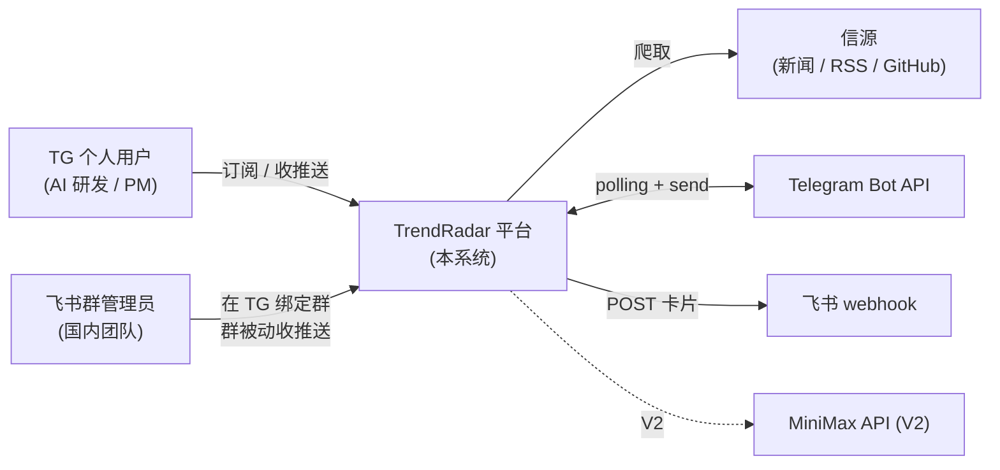
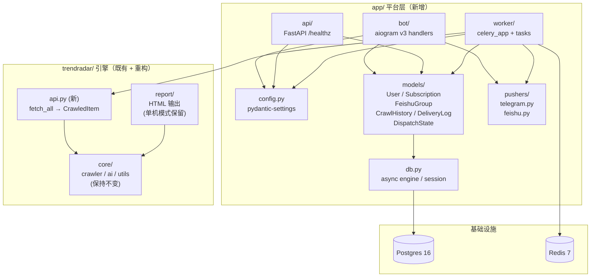
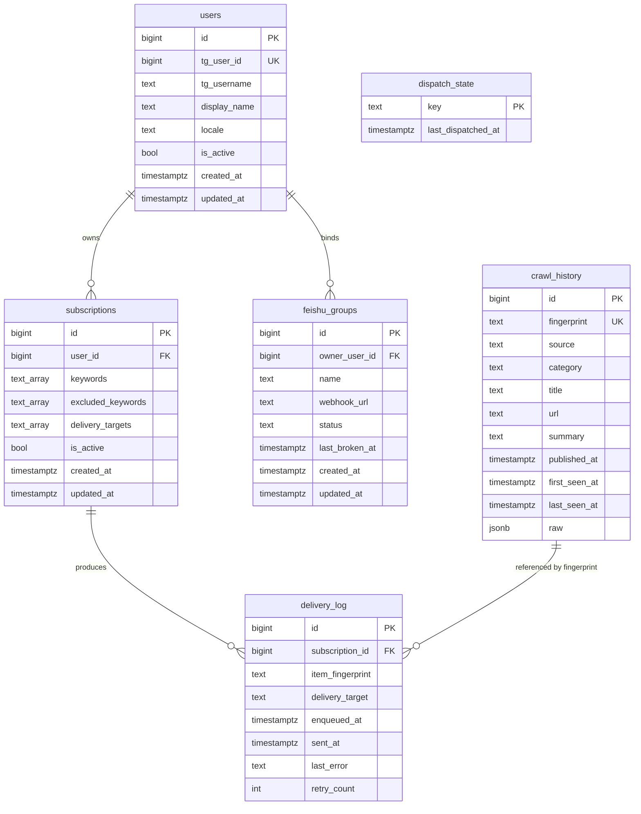
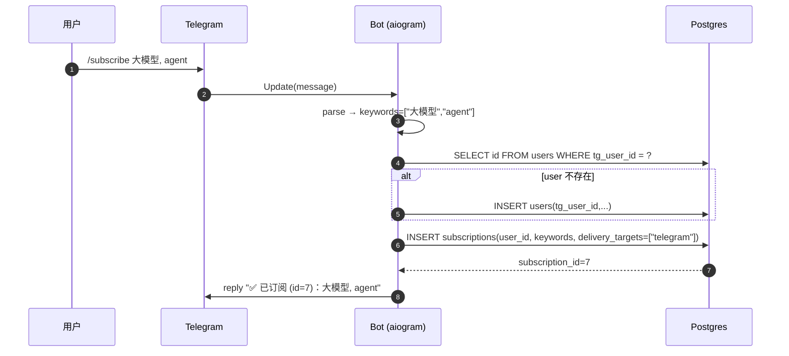
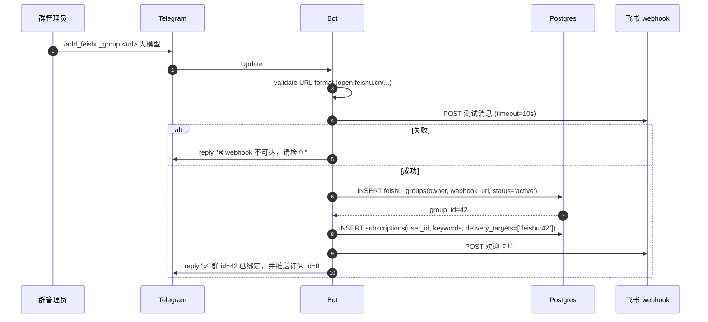
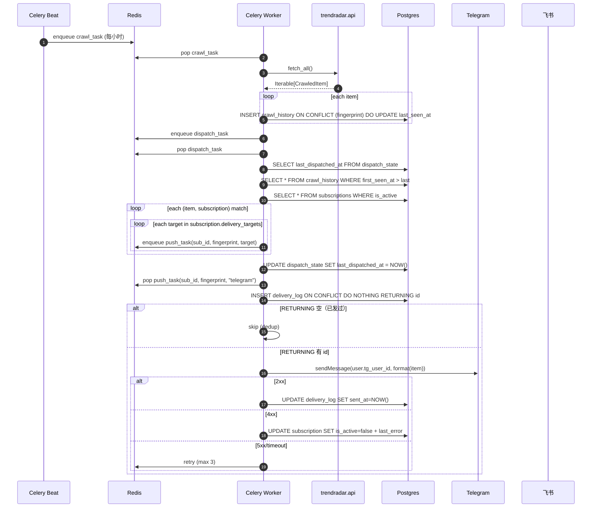
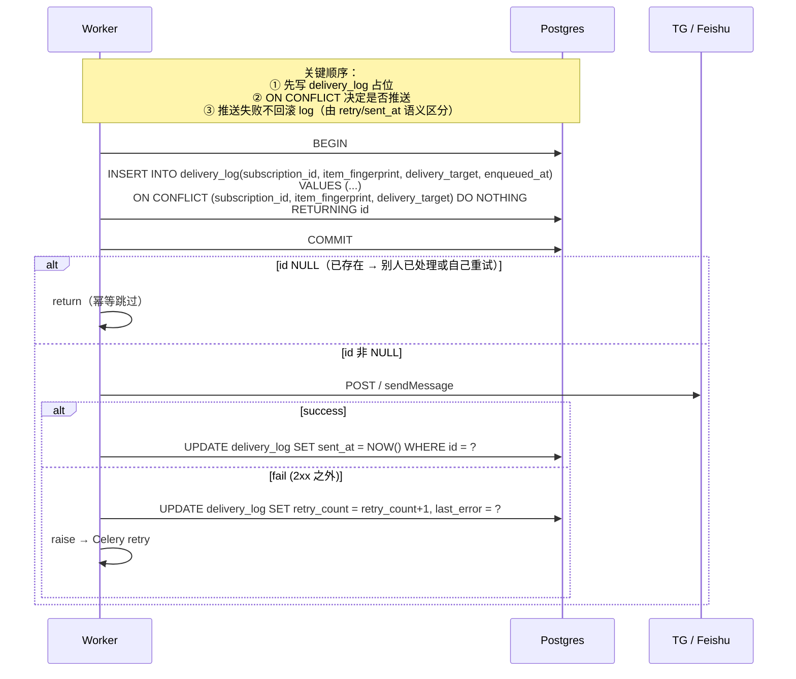
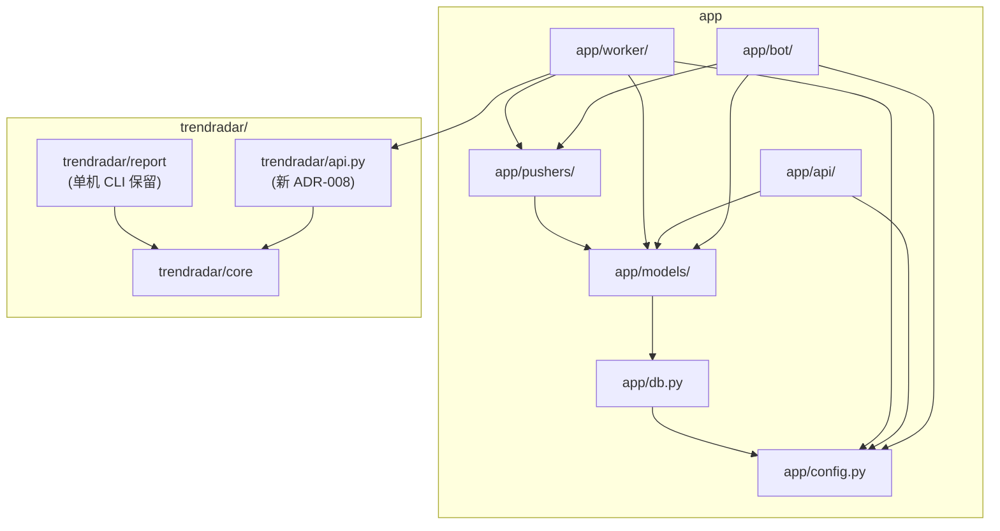

# TrendRadar 平台化 · 技术方案

> **版本**：v0.1 DRAFT
> **作者**：neo + Claude
> **日期**：2026-04-24
> **上游依赖**：[product-spec.md](./product-spec.md) v0.3、[architecture.md](./architecture.md) v0.2
> **下游**：implementation tasks（本文档评审后拆成 task）

---

## Review Status

| 章节 | 状态 | 备注 |
|---|---|---|
| §1 系统上下文（C4 L1） | ✅ Aligned (v0.1) | |
| §2 组件分解（C4 L2） | ✅ Aligned (v0.1) | |
| §3 数据模型 | ✅ Aligned (v0.1) | 重点评审 |
| §4 核心流程时序图 | ✅ Aligned (v0.1) | 重点评审 |
| §5 模块依赖 | ✅ Aligned (v0.1) | app ↔ trendradar 边界 |
| §6 本地 vs 生产差异 | ✅ Aligned (v0.1) | |
| §7 迁移路径 | ✅ Aligned (v0.1) | trendradar 重构 + 历史数据 |
| §8 容量初估 | ✅ Aligned (v0.1) | |
| §9 测试策略 | ✅ Aligned (v0.1) | |

## 验收标准自检

| # | 标准 | 自检 |
|---|---|---|
| T1 | 系统上下文图 + 组件图（mermaid） | ✅ §1 + §2 |
| T2 | ER 图 + 全部字段 + 索引策略 | ✅ §3 |
| T3 | 核心流程时序图：订阅 / 爬取 / 推送 / 去重 | ✅ §4（4 个 sequence diagram） |
| T4 | 模块依赖图：app/ ↔ trendradar/ 边界 | ✅ §5 |
| T5 | local / prod 差异矩阵 | ✅ §6 |
| T6 | 迁移路径：现有单用户数据/配置如何接入 | ✅ §7 |
| T7 | 容量初估：单 VM 能撑多少用户 | ✅ §8 |
| T8 | 字段有业务语义而非纯技术描述 | ✅ §3 每字段有注释 |
| T9 | 测试策略（unit / integration / e2e） | ✅ §9 |

---

## §1 系统上下文（C4 Level 1）



**外部依赖**

| 外部 | 交互 | 故障容忍 |
|---|---|---|
| 信源（~30 个） | 爬取读，failure 跳过单个源 | 单源失败不阻塞其他 |
| Telegram Bot API | 双向；bot polling + send_message | 重试 3 次 + 标记 broken |
| 飞书 webhook | 单向 POST | 同上 + rate limit 缓冲 |
| MiniMax（V2） | 单向 HTTP POST | 重试 3 次 + 降级不带摘要 |

---

## §2 组件分解（C4 Level 2）



**关键边界**
- `app/` **单向依赖** `trendradar.api`（ADR-008 合约）
- `trendradar/` **不感知** `app/` 的存在
- `pushers/` 被 `bot/`（欢迎卡片）和 `worker/`（定时推送）共用

---

## §3 数据模型

### §3.1 ER 图



### §3.2 表字段详解

#### `users`
| 字段 | 类型 | 业务含义 | 备注 |
|---|---|---|---|
| id | BIGSERIAL PK | 内部 user id | |
| tg_user_id | BIGINT UNIQUE NOT NULL | Telegram 用户 id（会话唯一身份） | 索引；来自 `message.from_user.id` |
| tg_username | TEXT NULL | 便于 UI 展示 | 可变（TG 改名），不做依赖 |
| display_name | TEXT NULL | 冗余，V2 展示用 | |
| locale | TEXT DEFAULT 'zh-CN' | V2 推送语言偏好 | |
| is_active | BOOL DEFAULT true | `/pause` 后整体暂停 | |
| created_at / updated_at | TIMESTAMPTZ | 审计 | |

**索引**：UNIQUE(tg_user_id)、WHERE is_active 部分索引（V2 用）

#### `subscriptions`
| 字段 | 类型 | 业务含义 | 备注 |
|---|---|---|---|
| id | BIGSERIAL PK | 用户在 TG 看到的订阅 id（`/list` 展示） | |
| user_id | BIGINT FK(users) ON DELETE CASCADE | 订阅归属 | 索引 |
| keywords | TEXT[] NOT NULL | contains 匹配关键词 | 至少 1 个；大小写不敏感 |
| excluded_keywords | TEXT[] DEFAULT '{}' | 排除词（V2 启用） | 先预留字段 |
| delivery_targets | TEXT[] NOT NULL | 投递目标列表 | `["telegram"]` / `["feishu:42"]` / 二者皆 |
| is_active | BOOL DEFAULT true | 单订阅暂停（与 user.is_active 叠加） | |
| created_at / updated_at | TIMESTAMPTZ | | |

**索引**：(user_id, is_active)

**CHECK 约束**：`array_length(keywords, 1) >= 1`；`array_length(delivery_targets, 1) >= 1`

#### `feishu_groups`
| 字段 | 类型 | 业务含义 | 备注 |
|---|---|---|---|
| id | BIGSERIAL PK | 群内部 id，对用户可见（`/my_feishu_groups` 里返回） | |
| owner_user_id | BIGINT FK(users) | 绑定者 = 群管理员 TG 身份 | 删除 user 时级联 |
| name | TEXT NULL | 群显示名（用户在 `/add_feishu_group` 可选填） | |
| webhook_url | TEXT NOT NULL | 推送目标 | **UNIQUE**（同一 webhook 不允许二次绑定） |
| status | TEXT DEFAULT 'active' | active / broken / removed | broken = push 收到 4xx |
| last_broken_at | TIMESTAMPTZ NULL | 上次异常时间 | |

**索引**：(owner_user_id, status)、UNIQUE(webhook_url)

#### `crawl_history`
| 字段 | 类型 | 业务含义 | 备注 |
|---|---|---|---|
| id | BIGSERIAL PK | 内部 id | |
| fingerprint | TEXT UNIQUE NOT NULL | 去重主键（sha256 短哈希） | ADR-011 算法 |
| source | TEXT NOT NULL | 信源名（`HackerNews` / `36kr`） | |
| category | TEXT NULL | 分类（由 trendradar 指定） | |
| title | TEXT NOT NULL | 标题（contains 匹配目标） | |
| url | TEXT NOT NULL | 原文链接（已规范化） | |
| summary | TEXT NULL | trendradar 提供的简介，V2 LLM 覆盖 | |
| published_at | TIMESTAMPTZ NULL | 发布时间（可能缺失） | |
| first_seen_at | TIMESTAMPTZ NOT NULL DEFAULT NOW() | 首次入库时间（dispatch watermark） | |
| last_seen_at | TIMESTAMPTZ NOT NULL DEFAULT NOW() | 最新见到时间（ON CONFLICT 更新） | |
| raw | JSONB | 原始字段保留便于 V2 扩展 | |

**索引**：
- UNIQUE(fingerprint)
- (first_seen_at DESC) — dispatch 扫新增用
- GIN(lower(title)) — contains 匹配加速（V2 数据量大时启用，V1 可先不加）

#### `delivery_log`
| 字段 | 类型 | 业务含义 | 备注 |
|---|---|---|---|
| id | BIGSERIAL PK | | |
| subscription_id | BIGINT FK(subscriptions) | 谁订阅命中的 | |
| item_fingerprint | TEXT NOT NULL | 引用 `crawl_history.fingerprint`（逻辑 FK，不加物理 FK 减耦合） | |
| delivery_target | TEXT NOT NULL | `telegram:user:<tg_uid>` / `feishu:group:<id>` | |
| enqueued_at | TIMESTAMPTZ DEFAULT NOW | 入队占位时间（INSERT 时） | |
| sent_at | TIMESTAMPTZ NULL | 发送成功后 UPDATE | NULL = 尚未发 / 发失败 |
| last_error | TEXT NULL | 最近一次失败原因 | |
| retry_count | INT DEFAULT 0 | 累计重试次数 | |

**约束**：**UNIQUE(subscription_id, item_fingerprint, delivery_target)** — 幂等核心（ADR-011）

**索引**：(subscription_id, enqueued_at DESC)、(sent_at) WHERE sent_at IS NULL（V2 扫失败用）

#### `dispatch_state`（Q13 决策）
| 字段 | 类型 | 业务含义 |
|---|---|---|
| key | TEXT PK | 固定值 `'global'`（V1 全局 watermark） |
| last_dispatched_at | TIMESTAMPTZ NOT NULL | 上次 dispatch 已处理到的 crawl_history.first_seen_at |

V1 全局 cursor 单行：`SELECT last_dispatched_at FROM dispatch_state WHERE key = 'global'`。
V2 如果要做 per-user 订阅后不回推历史，改成 `key = 'sub:<id>'` 多行。

---

## §4 核心流程时序图

### §4.1 订阅流程 `/subscribe 大模型, agent`



### §4.2 绑定 Feishu 群 `/add_feishu_group <url> <keywords>`



### §4.3 定时爬取 + 扇出 + 推送



### §4.4 去重机制细节（ADR-011 核心）



**关键保证**
- `INSERT ... ON CONFLICT` 原子决定"谁在送这条"
- 成功则 `sent_at` 非 NULL；失败则 `retry_count > 0` 且 `sent_at` NULL
- Worker 崩在 INSERT 之后但推送前 → `task_acks_late` 让任务重排，下次 ON CONFLICT 跳过，但 delivery_log 里那条 `sent_at` 永远是 NULL → **可能未送达的消息**（需要 V2 补 reconciler 扫 `sent_at IS NULL AND enqueued_at < NOW() - 30 分钟` 强制重发）
- V1 接受：极小概率（只有 worker 在 INSERT commit 后与 send 之间崩），代价只是该 item 对该用户丢失

---

## §5 模块依赖



**依赖原则**
1. `app/` 层不引用 `trendradar/report`（报告输出是单机 CLI 内部事务）
2. `app/worker/` 只通过 `trendradar/api.fetch_all` 这**唯一入口**调用引擎
3. `trendradar/` 包**不 import app 任何模块**（保持可独立分发）
4. `pushers/telegram.py` 和 `pushers/feishu.py` 只依赖 `httpx` 和 `models`（无 aiogram 依赖 → 方便 worker 复用）

---

## §6 本地 vs 生产差异

| 维度 | 本地（macOS） | 生产（Oracle VM Linux ARM） |
|---|---|---|
| Python 进程 | `uv run` 直开 4 个 | 4 个 container（systemd restart） |
| TG Bot Token | dev bot（token in `.env.local`） | prod bot（独立 token；.env via systemd EnvironmentFile） |
| Worker 并发 | `--concurrency=1` | `--concurrency=2` 起 |
| PG 端口 | 宿主 5432 对外 | 仅 VM 内网（docker network） |
| Redis 端口 | 宿主 6379 对外 | 仅 VM 内网 |
| Redis 持久化 | 可选关 | `appendonly yes --appendfsync everysec` |
| Caddy / TLS | 无 | `:443` 自动 Let's Encrypt |
| 日志 | stdout 直读 | docker `json-file` 10MB × 5 轮转 |
| 备份 | 无 | `03:00 cron pg_dump → rclone → CF R2` |
| Sentry | 可选接 | 必开（4 进程） |
| 健康检查 | `curl :8000/healthz` | Uptimerobot + `?deep=1` |
| 镜像架构 | `linux/arm64` 或 `linux/amd64`（M1/M2 mac 和 Linux ARM 一致） | `linux/arm64`（Ampere） |

---

## §7 迁移路径（trendradar 单用户 → app 平台）

### §7.1 trendradar 包重构步骤（ADR-008 落地）

| # | 步骤 | 输入 | 输出 | 估时 |
|---|---|---|---|---|
| 1 | 新建 `trendradar/api.py`：定义 `CrawledItem` dataclass + `fetch_all` 签名 | | api 骨架 | 0.2 天 |
| 2 | 从 `trendradar/core/crawler` 抽"只爬不写"函数 | 现有 crawler 代码 | `_crawl_items(config) -> list[CrawledItem]` | 0.5 天 |
| 3 | `fetch_all` 组装：读 config → 调 _crawl_items → 返回 iterable | | 可用 api | 0.2 天 |
| 4 | 原 `python -m trendradar` CLI 保留，内部改用 `fetch_all + 原 report 层` | | 单机模式兼容 | 0.2 天 |
| 5 | 单元测试覆盖 fetch_all（mock HTTP） | | 测试通过 | 0.2 天 |

合计 1.3 天（架构文档 ADR-008 估计 1-1.5 天相符）。

### §7.2 既有数据处理

| 数据 | V1 方案 | 理由 |
|---|---|---|
| 既有 `output/sqlite/` 历史库 | **抛弃，从头开始** | 历史数据在 CI 上本来就没持久化（现状），价值不大 |
| 既有 `config/config.yaml` 信源配置 | **保留**，作为 trendradar 引擎的默认 config | 信源列表是 trendradar 本职，不搬到 DB |
| 既有 `output/html/` 静态页 | **保留**，CF Pages 继续展示（产品 §7 反向边界外的既有功能） | 不拆单用户爬虫的展示页 |

### §7.3 环境变量收敛

既有 `config/config.yaml` + 新 `.env` 的职责划分：

| 用途 | 位置 |
|---|---|
| 信源列表、分类规则、爬取策略 | `config/config.yaml`（trendradar 内部） |
| DB 连接、TG token、Redis URL、Sentry DSN | `.env`（app 平台层） |
| 既有 FEISHU_WEBHOOK_URL 等（单机推送用） | 兼容保留，但 V1 不再用（改走 DB 多群） |

---

## §8 容量初估

### V1（10 用户）

| 指标 | 估算 | 瓶颈分析 |
|---|---|---|
| 爬取频率 | 每小时 1 次 | — |
| 每次爬取新 item | 50-100 条 | VM 20-50s CPU，99% idle |
| dispatch 匹配成本 | 10 sub × 100 item = 1k 次 `contains` | Python 微秒级 |
| 推送触发 | ~5 命中/用户/小时 × 10 用户 × 2 目标 = **100 推送/小时** | TG 限速无压力；Feishu 每群 100/min 宽裕 |
| PG 写入 | 100 crawl_history + 100 delivery_log = **200 rows/hr** | 轻松 |
| Redis 流量 | < 200 msg/hr | 微量 |
| **CPU 占用** | < 5% 持续 | 4 核 24GB VM 极度冗余 |

### V2（200 用户，加 LLM）

| 指标 | 估算 | 瓶颈分析 |
|---|---|---|
| dispatch 匹配成本 | 200 × 100 = 20k 次 contains | < 50ms |
| 推送 | 200 × 5 × 2 = **2000/小时 ≈ 33/min** | TG OK；Feishu 每单群限 100/min，需 rate-limit |
| LLM 调用（翻译） | 100 英文 item × 50% 用户命中 = ~3000 次/天 | MiniMax 延迟 500ms-2s；用 Celery worker 并发消化 |
| PG 写入 | 2.2k rows/hr | 轻松 |
| crawl_history 年累 | 100 × 24 × 365 ≈ **876k 行** ≈ 900MB | VM 本地盘充足 |
| 备份 | pg_dump 压缩 ~200MB/月 | R2 10GB 免费够 |

### V3（500-1000 用户）

- dispatch 开销线性增长：500 × 100 = 50k 比较 / hr，仍 < 200ms
- 推送 5k/hr 需要扩到 `--concurrency=4`
- LLM 成本 ¥300-500 / 月
- 若 Oracle 不稳 → Hetzner CX22（仍然够）

**结论**：单 Ampere 4c/24G VM 对 V3 500 用户仍有冗余；V1-V2 阶段**不需要**扩容。

---

## §9 测试策略

### §9.1 分层覆盖

| 层 | 工具 | 目标覆盖率 V1 | 目标覆盖率 V2 |
|---|---|---|---|
| Unit | pytest + pytest-asyncio | 70% | 80% |
| Integration | pytest + docker-compose（real PG + Redis） | 50% | 70% |
| E2E（半手动） | 真实 dev TG bot + 测试 Feishu 群 | 5 个关键 flow | 10+ flow |

### §9.2 Unit（覆盖范围）

```
tests/unit/
├── test_fingerprint.py           # URL 规范化 / sha256 稳定性
├── test_match.py                 # contains + excluded_keywords 逻辑
├── test_handlers_subscribe.py    # aiogram /subscribe 解析（mock PG）
├── test_handlers_feishu.py       # /add_feishu_group 校验
├── test_pushers_telegram.py      # format → payload（mock httpx）
├── test_pushers_feishu.py        # 卡片 schema + rate-limit hook
└── test_trendradar_api.py        # fetch_all 结构化输出（mock 爬虫）
```

### §9.3 Integration（覆盖关键业务路径）

```
tests/integration/
├── test_subscribe_flow.py        # /subscribe → DB 落库 → /list 返回
├── test_dispatch_idempotency.py  # 跑 2 次 dispatch 不重复推（delivery_log UNIQUE）
├── test_feishu_bind.py           # /add_feishu_group → webhook ok → DB 创建
├── test_crawl_onconflict.py      # 同 fingerprint 二次写 → last_seen_at 更新
├── test_push_retry.py            # 模拟 5xx → 重试 3 次 → 标记失败
└── test_push_broken_channel.py   # 模拟 4xx → subscription 标记 broken
```

**基础设施**：`docker compose up` + `alembic upgrade head` + pytest。CI 用 `services` 起 PG/Redis container。

### §9.4 E2E 关键 flow（V1 半手动）

| # | flow | 验收 |
|---|---|---|
| 1 | TG /subscribe → 爬取一次 → TG 收到推送 | 手机真实收到 |
| 2 | TG /add_feishu_group（真实 webhook）→ 爬取 → 飞书群收到卡片 | 飞书 App 收到 |
| 3 | 跑 crawl 两次 → delivery_log 里同 (sub, fp, target) 只 1 条 | 数据库查 |
| 4 | 人为关掉 webhook（模拟失效）→ 观察 status=broken 且 TG 有告警 | DB + 消息 |
| 5 | Worker 人为 kill → `/healthz?deep=1` 失败 → Uptimerobot 告警 | 事件链验证 |

### §9.5 CI / 本地测试跑法

```Makefile
# Makefile 入口（待加）
test-unit:
  uv run pytest tests/unit -q

test-integration:
  docker compose up -d postgres redis
  uv run alembic upgrade head
  uv run pytest tests/integration -q

test-all: test-unit test-integration
```

GitHub Actions workflow：
```yaml
# .github/workflows/test.yml (待加)
- services: postgres:16, redis:7
- uv sync
- alembic upgrade head
- pytest
```

---

## 待定事项

| # | 问题 | 推荐 |
|---|---|---|
| Q16 | crawl_history 数据保留策略 | ✅ **V1 永久；V2 加 30 天 retention + R2 归档** |
| Q17 | push 失败 3 次后处理 | ✅ **V1 仅记 last_error + retry_count；V2 接 Sentry alert** |
| Q18 | `/pause /resume` 粒度 | ✅ **两级都做**（user 级 + subscription 级） |
| Q19 | dispatch 触发复用 | ✅ **复用同一 dispatch_task**，触发源用 metadata 区分 |
| Q20 | 测试 bot 真实 vs mock | ✅ **unit 全 mock；integration mock；e2e 真实 dev bot** |

---

**下一步**：请评审。评审通过后拆 implementation tasks（按 §4 时序图每步 + §7 迁移步骤 1-5）重置任务列表，恢复代码实施。
